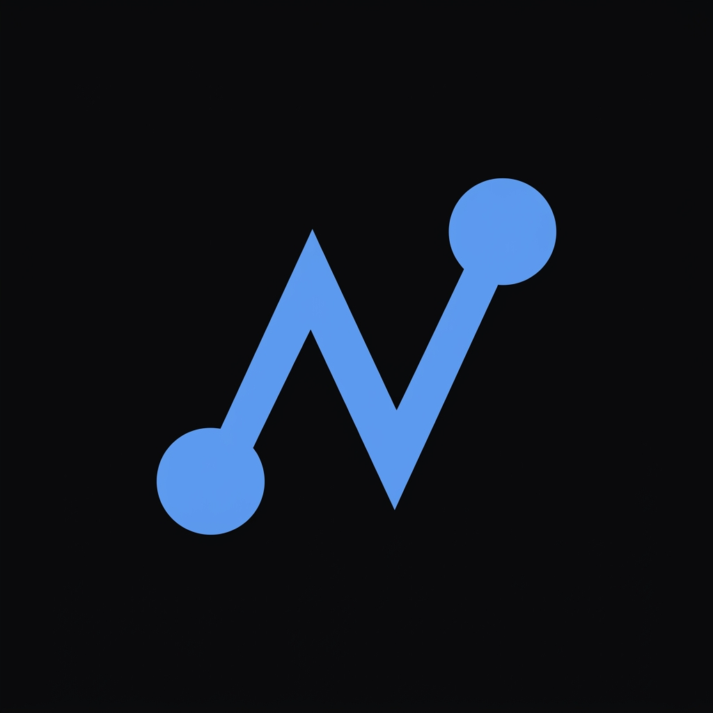

<p align="center">
  
</p>

<h1 align="center">nexframe</h1>

<p align="center">
  AI automation studio. We build systems that think.
</p>

<p align="center">
  <a href="https://hybirdss.github.io/ai-automation-portfolio/">Live Site</a> &nbsp;&middot;&nbsp;
  <a href="https://hybirdss.github.io/ai-automation-portfolio/dashboard.html">Command Center</a> &nbsp;&middot;&nbsp;
  <a href="https://hybirdss.github.io/ai-automation-portfolio/email-triage.html">Email Triage</a> &nbsp;&middot;&nbsp;
  <a href="https://hybirdss.github.io/ai-automation-portfolio/lead-capture.html">Lead Scoring</a>
</p>

<br>

## What this is

Five production AI systems, running on live infrastructure, built to show how we work.

Each one solves a specific problem — email overload, lead qualification, competitor tracking, knowledge base search, operational visibility — with AI that explains its reasoning, not just its output.

## Systems

| System | What it does | Impact |
|--------|-------------|--------|
| **AI Command Center** | Aggregates email, competitor, and lead data into one auto-refreshing screen | 4 data sources &rarr; 1 dashboard |
| **Email Triage** | Classifies every email by urgency, generates draft replies, surfaces critical items | 3hrs/day manual sorting &rarr; 0 |
| **Competitor Intelligence** | Tracks pricing changes, feature launches, and market moves across 6 competitors | Weeks late &rarr; minutes |
| **Lead Scoring** | Scores, classifies, and routes every inbound lead with AI-written reasoning | 48hr response &rarr; instant |
| **Knowledge Base Chatbot** | Scrapes a URL, embeds content, answers questions with cited responses | URL in &rarr; AI assistant out |

## Architecture

```
Landing page (GitHub Pages)
  ├── Static HTML dashboards (hardcoded data, instant load)
  ├── AI chatbot (Cloudflare Worker → xAI Grok API)
  └── Contact form (n8n webhook → Telegram)

Live API demos (_live/ directory, not deployed)
  └── n8n workflows → Neon PostgreSQL + pgvector + Cohere embeddings
```

**Design decisions:**
- Demo dashboards load instantly — no API dependency, no cold start
- Chatbot runs through a Cloudflare Worker proxy with rate limiting and prompt injection defense
- API keys never touch the frontend
- Original API-connected versions preserved in `_live/` for client deployment

## Stack

Workflow orchestration, large language models, vector search, real-time dashboards, cloud infrastructure. Connects to Slack, Gmail, Salesforce, HubSpot, Notion, Stripe, and anything with an API.

## Contact

Available for new projects.

**Upwork:** [nexframe](https://www.upwork.com/freelancers/~01488801c28f4a7010)

---

<sub>Seoul, South Korea &middot; Built by Yunsu Kim</sub>
